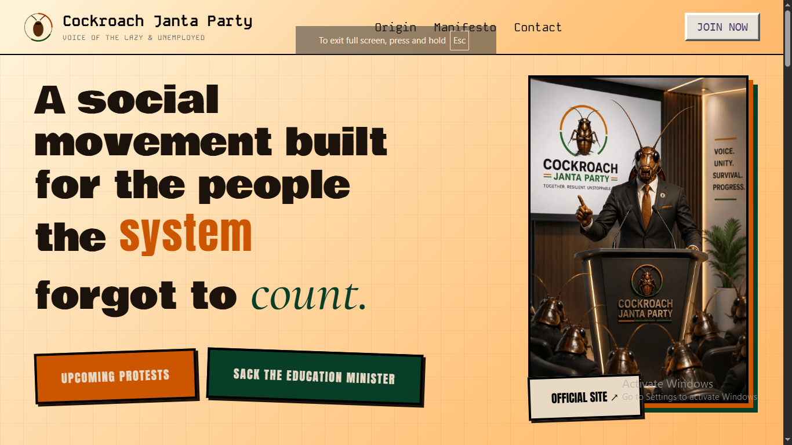

# Cockroach Janta Party (CJP)

A satirical political movement website archive inspired by the rapid rise of the Cockroach Janta Party (CJP), one of India's most talked-about internet-born youth movements.

## Live Preview

https://cockroach-janta-party-six.vercel.app/

## Landing Page

## Features

### Landing Page

* Theme inspired from Orginal Webite
* Official website and petition links
* Responsive design and cool

## This Website uses:

* HTML
* CSS
* JavaScript
* Vercel

## Design Philosophy

Instead of feeling like a modern websites, I tried making it feel more papery and asthetic.

## Why I Built This

I wanted to start something with, then this movement started and I supported it too so, i built this to show my support

## What I Learned

Through this project I learned:

* Advanced CSS layouts
* Responsive design techniques
* Visual storytelling through UI
* Some Javascript

## Disclaimer

This project is a archive of the original CJP(cockroach janta party) members and actions.

All trademarks, logos, names, and references belong to their respective owners.

## Author

Developed by Senvor.
