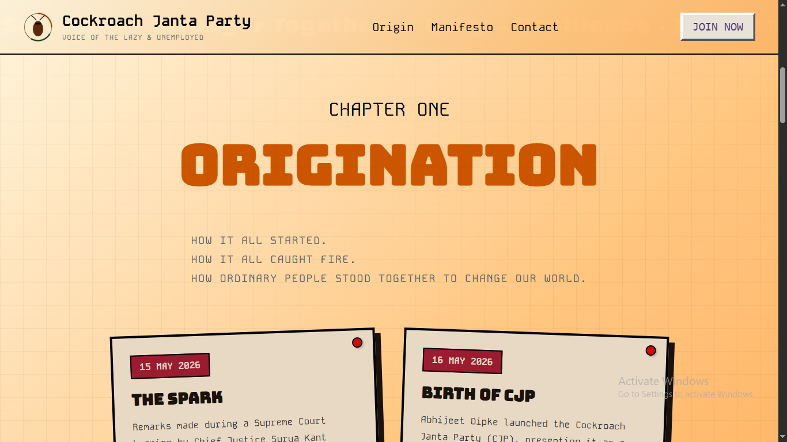
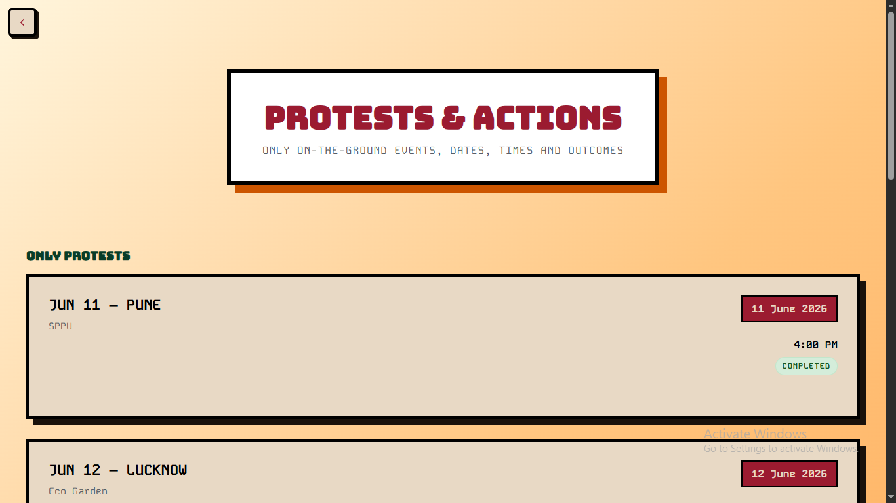

# Cockroach Janta Party (CJP)

A satirical political movement website inspired by the rapid rise of the Cockroach Janta Party (CJP), one of India's most talked-about internet-born youth movements.

The website combines campaign-poster aesthetics, retro typography, and interactive storytelling to document the movement's origins, manifesto, protests, and community.

## Live Preview

https://cockroach-janta-party-six.vercel.app/

## Screenshots

### Hero Section


### Origin Board



### Protest Portal



## Features

### Landing Page

* Campaign-inspired hero section
* Animated call-to-action buttons
* Official website and petition links
* Responsive design
* Retro political poster aesthetic

### Origin Timeline

* Custom poster-board layout
* Crooked campaign posters
* Push-pin effects
* Interactive hover animations
* Visual storytelling of the movement's growth

### Manifesto

* Newspaper-inspired manifesto layout
* Structured policy points
* Political pamphlet aesthetic
* Responsive paper-style design

### Contact Section

* Founder profile card
* Official contact information
* Social media directory
* Volunteer recruitment section

### Protest Portal

* Dedicated protest archive page
* Upcoming and completed protest listings
* Consistent campaign-style design language
* Expandable structure for future events

### Interactive Elements

* Poster hover animations
* Chapter typewriter effects
* Secret dossier easter egg
* Custom paper textures and shadows
* Responsive mobile layouts

## Tech Stack

* HTML5
* CSS3
* Vanilla JavaScript
* Vercel Deployment

No frameworks, libraries, or build tools were used.

## Project Structure

```text
public/
│
├── assets/
│   ├── Cockroach_Janta_Party_logo.png
│   ├── cockroach.png
│   └── abhijeet.jpg
│
├── index.html
├── protest.html
├── style.css
└── script.js
```

## Design Philosophy

The visual identity draws inspiration from:

* Political campaign posters
* Public notice boards
* Grassroots activism
* Satirical political branding
* Retro print media
* Street protest culture

Instead of feeling like a modern SaaS landing page, the website was designed to feel like a living movement assembled by ordinary people using posters, pamphlets, and public walls.

Every design decision — from the crooked posters to the push pins and paper textures — reinforces that atmosphere.

## Why I Built This

I wanted to create a website that felt different from the polished, corporate style that dominates most modern websites.

The goal was to build something with personality and atmosphere. Rather than presenting information through standard cards and sections, I used campaign posters, notice boards, paper documents, and political pamphlet-inspired layouts to tell the story of the movement.

The project was also an opportunity to explore what can be achieved using only HTML, CSS, and JavaScript without relying on frameworks.

## Challenges

One of the biggest challenges was creating a website that felt handcrafted rather than corporate.

The poster-board layout required extensive experimentation with:

* Rotation values
* Shadows
* Poster spacing
* Push-pin placement
* Hover animations
* Responsive behavior

Another challenge was ensuring that every section had a unique identity while still feeling part of the same visual system.

## What I Learned

Through this project I learned:

* Advanced CSS layouts
* Responsive design techniques
* Visual storytelling through UI
* Creating reusable design systems with CSS variables
* Animation and interaction design
* Structuring multi-page static websites
* Designing for atmosphere instead of utility alone

## Future Improvements

* Backend for counting people
* More easter eggs
* Dynamic protest updates

## Local Development

Clone the repository:

```bash
git clone https://github.com/Senvor/Cockroach-Janta-Party.git
```

Navigate into the project:

```bash
cd Cockroach-Janta-Party
```

Start a local server:

```bash
python -m http.server 3000
```

Or use the VS Code Live Server extension.

Then open:

```text
http://127.0.0.1:3000/public/index.html
```

## Disclaimer

This project is a fan-made web experience inspired by public events and internet culture surrounding the Cockroach Janta Party movement.

All trademarks, logos, names, and references belong to their respective owners.

## Author

Developed by Senvor.
